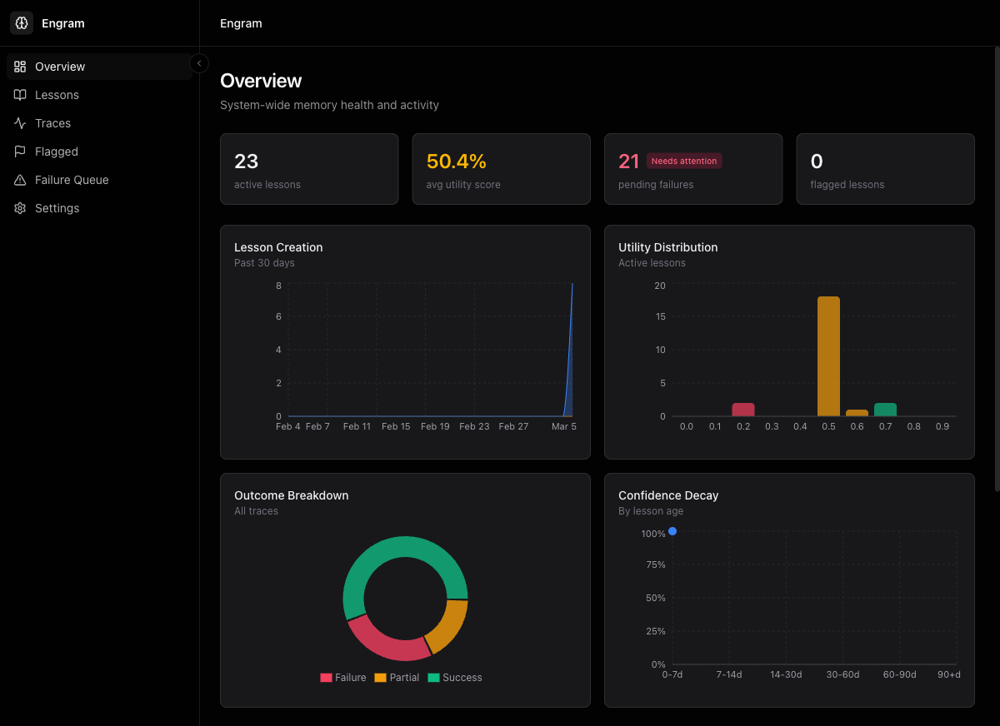
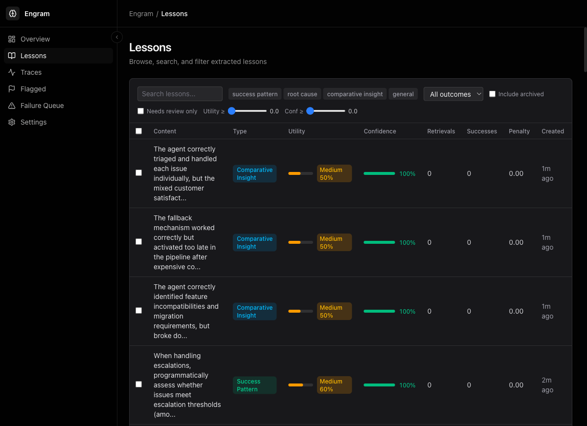
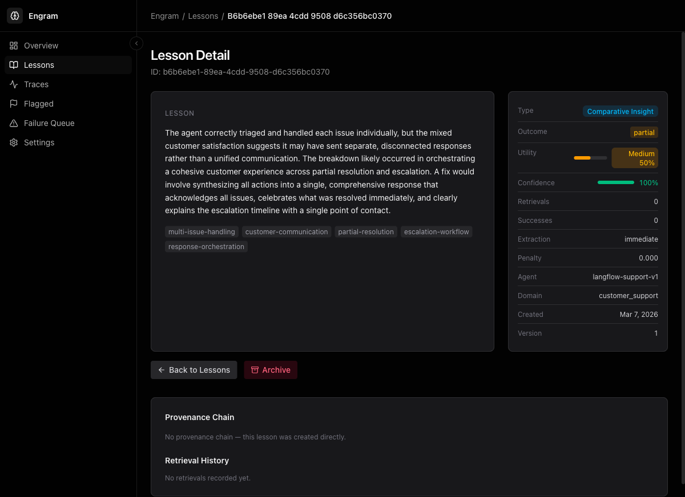
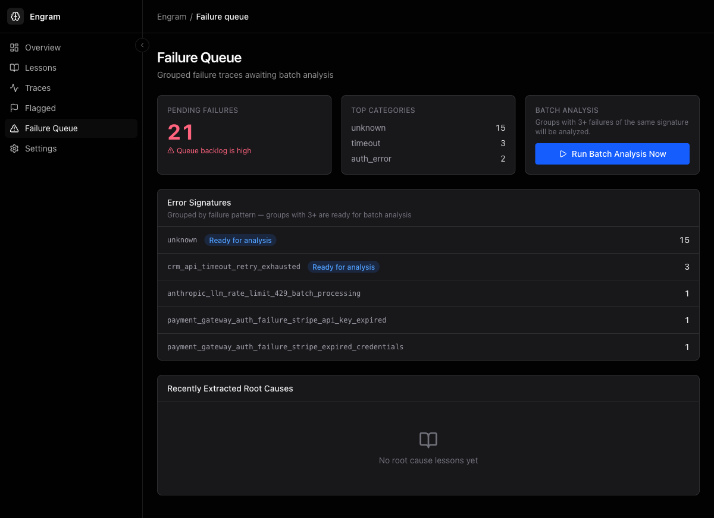
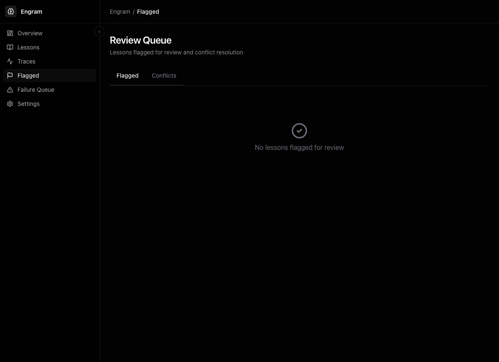

<div align="center">

# Engram

**Experiential memory for AI agents.**

Agents that learn from their own execution history — what worked, what didn't, and what to do differently next time.

[Quickstart](#quickstart) · [Architecture](#architecture) · [SDK](#sdk) · [Dashboard](#dashboard) · [Integrations](#integrations)



</div>

---

## Why Engram

Current agent memory tools store *facts and conversations* (Mem0, Letta). They don't store *how to handle errors*.

Research (PRAXIS, ReasoningBank, SkillWeaver) shows **10–50% success-rate improvements** when agents can recall prior execution experience. Engram is that layer: a service that ingests agent traces, distills reusable lessons, and serves them back at decision time.

| | Mem0 / Letta | Engram |
|---|---|---|
| Stores | User prefs, chat history | Procedural lessons (state → action → outcome) |
| Source | Conversations | OpenTelemetry traces |
| Retrieval | Semantic | Hybrid (vector + BM25 + metadata) |
| Decay | Static | Confidence decay + Bellman-style reward propagation |

## Quickstart

```bash
# Clone + start infrastructure
git clone https://github.com/your-org/engram && cd engram
docker compose up -d                    # postgres (pgvector) + redis + api

# Backend
cd backend
uv sync
uv run alembic upgrade head
uv run uvicorn app.main:app --reload --port 8000
uv run celery -A app.workers.celery_app worker --loglevel=info

# Dashboard
cd ../dashboard
npm install
npm run dev                             # http://localhost:5173
```

Point your agent at `http://localhost:8000` and start sending traces.

## SDK

```python
from engram import EngramClient

client = EngramClient(api_key="...", agent_id="support-bot-v2")

# At decision time — pull relevant lessons as prompt context
lessons = client.retrieve(
    context="user asking about refund policy",
    top_k=5,
)

# After execution — report the outcome so Engram can learn
client.report_outcome(trace_id="abc123", outcome="success")
```

Agents already instrumented with OpenTelemetry (LangChain, LangGraph, CrewAI) can export directly to the OTLP endpoint on `:4317` (gRPC) or `:4318` (HTTP) — no SDK required.

## Architecture

```
┌──────────────────────────────────────────────────────────────┐
│          LangGraph · CrewAI · OpenAI Agents · Custom          │
│                 ↕  OpenTelemetry / SDK                        │
├──────────────────────────────────────────────────────────────┤
│  Ingestion  →  Extraction (Claude)  →  Retrieval (hybrid)    │
├──────────────────────────────────────────────────────────────┤
│         PostgreSQL + pgvector   ·   Redis   ·   Celery        │
└──────────────────────────────────────────────────────────────┘
```

**Data model** — the core entity is a `Lesson`:

```python
class Lesson:
    task_context: str                # what the agent was trying to do
    action_taken: str                # what it did
    outcome: Literal["success", "failure", "partial"]
    lesson_text: str                 # LLM-distilled takeaway
    embedding: list[float]           # 384-dim, BAAI/bge-small-en-v1.5
    confidence: float                # decays over time, boosted on reuse
    utility: float                   # Bellman-style reward estimate
    tags: list[str]
    source_trace_id: str
```

See [`CLAUDE.md`](CLAUDE.md) for the full design doc.

## Tech Stack

**Backend** — FastAPI · PostgreSQL 16 + pgvector · SQLAlchemy 2.0 (async) · Alembic · Redis · Celery · OpenTelemetry · Anthropic Claude · sentence-transformers

**Dashboard** — React 19 · TypeScript strict · Vite · TanStack Router / Query / Table · shadcn/ui · Tailwind v4 · Recharts · Zustand · Zod

**Infra** — Docker Compose · pytest · Vitest

## Dashboard

A React SPA for monitoring, exploring, and curating the memory pool. Designed for platform teams running production agents — think Linear density, Datadog data-richness.

| | |
|:---:|:---:|
|  |  |
| **Lessons explorer** — filter by type, utility, confidence, outcome | **Lesson detail** — provenance graph + retrieval history |
|  |  |
| **Failure queue** — grouped by error signature, batch-analyzed | **Review** — flagged lessons and conflict pairs |

## Integrations

End-to-end tests validate the full learn → retrieve → improve loop against two real-world agent systems:

- **Langflow customer support** (`integrations/langflow/`) — 25 fixture traces, multi-agent CRM + payments scenarios
- **TestZeus Hercules** (`integrations/hercules/`) — 34 fixture traces, Playwright test-automation failures

```bash
cd integrations
pytest -v -m integration --tb=short
```

See [`integrations/README.md`](integrations/README.md) for details.

## Project Layout

```
engram/
├── backend/         FastAPI service, Celery workers, Alembic migrations
├── dashboard/       React SPA (Vite + TanStack)
├── sdk/python/      EngramClient + LangChain middleware + OTel exporter
├── integrations/    End-to-end tests against Langflow and Hercules
├── docs/            Architecture and API reference
└── docker-compose.yml
```

## Status

| Phase | Scope | Status |
|---|---|---|
| 1 | Core loop: ingest → extract → retrieve | ✅ |
| 2 | Hybrid retrieval, confidence decay, conflict detection | ✅ |
| 2.5 | Bellman reward propagation, failure-queue batch analysis | ✅ |
| 3 | Management dashboard | ✅ |
| 4 | OTel receiver, multi-tenant auth, LangGraph middleware | 🚧 |

## License

TBD.
